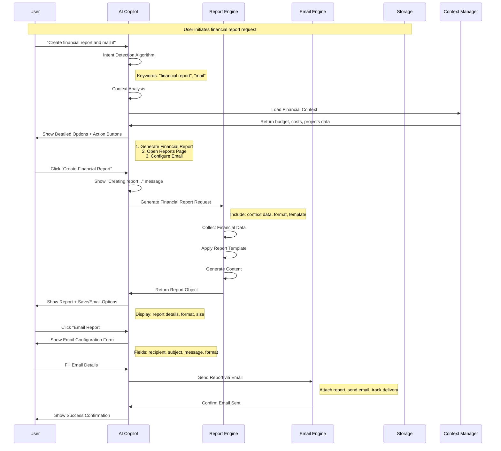
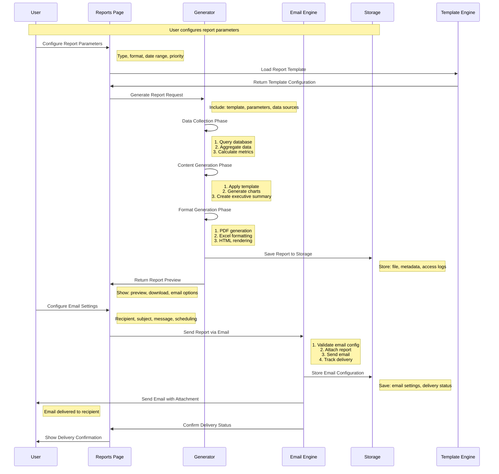
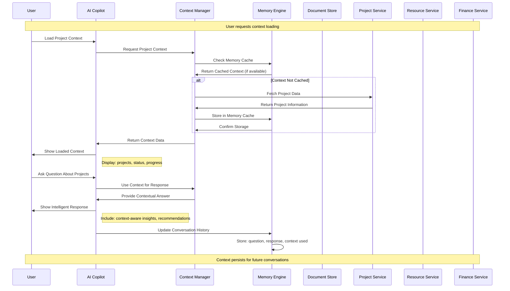
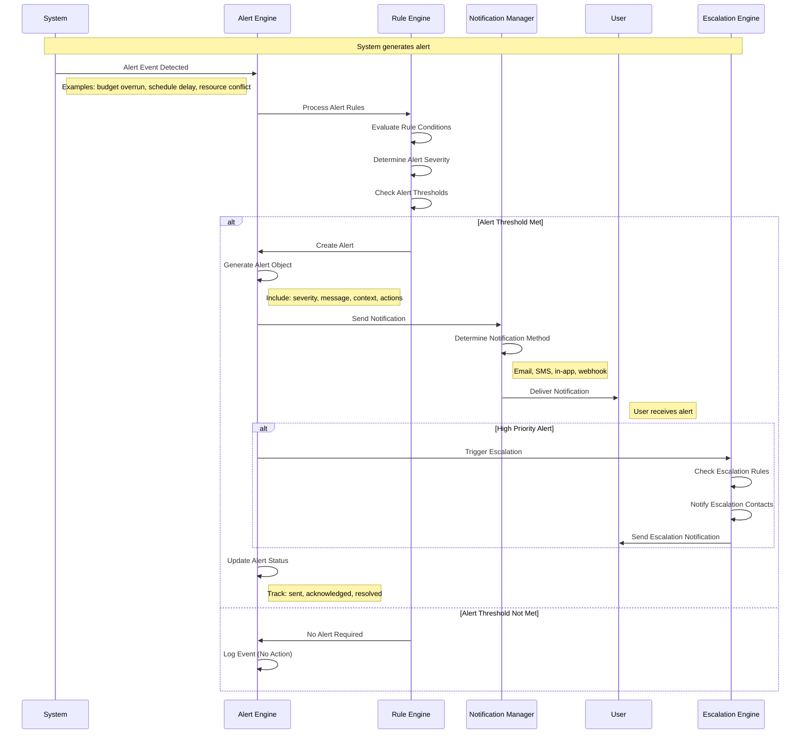
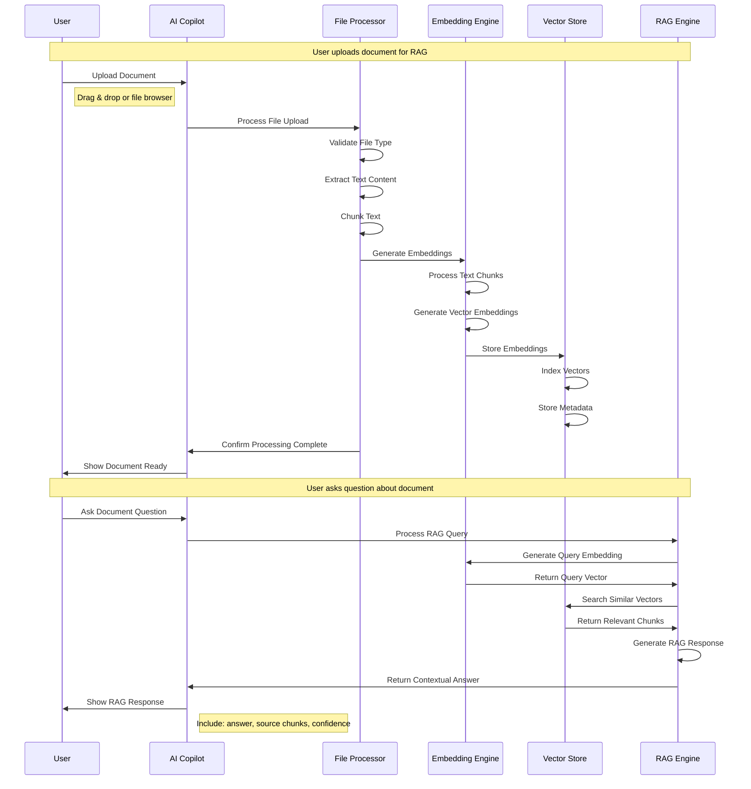
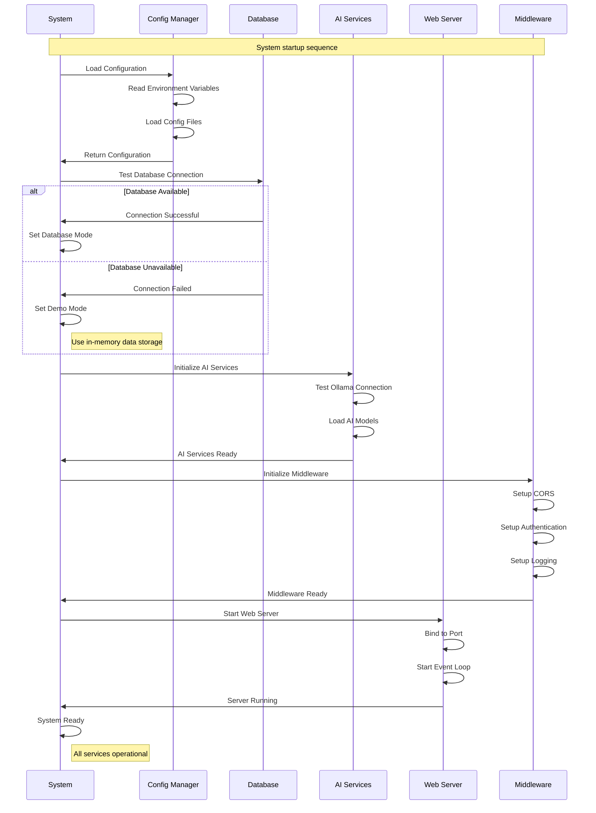

# 🔄 Technical Flow Diagrams - Project Portfolio Management System

## **📋 Document Information**

- **Document Type:** Technical Flow Specifications
- **Version:** 1.0
- **Date:** January 2025
- **Project:** Project Portfolio Management System with AI Copilot
- **Status:** Implementation Complete

---

## **🎯 Overview**

This document provides detailed technical flow diagrams and implementation specifications for all major system components. Each flow includes:

- **Sequence diagrams** showing component interactions
- **Data flow** specifications
- **Error handling** and fallback mechanisms
- **Performance** considerations
- **Security** implementations

---

## **🔄 1. AI Copilot Financial Report Creation Flow**

### **Complete Flow Diagram**



### **Technical Implementation Details**

#### **Intent Detection Algorithm:**
```python
def detect_intent(message: str) -> Intent:
    keywords = {
        'financial_report': ['financial report', 'budget report', 'cost analysis'],
        'email_request': ['mail', 'email', 'send', 'deliver'],
        'file_save': ['save', 'folder', 'store', 'download']
    }
    
    message_lower = message.lower()
    detected_intents = []
    
    for intent, patterns in keywords.items():
        if any(pattern in message_lower for pattern in patterns):
            detected_intents.append(intent)
    
    return Intent(
        primary_intent=detected_intents[0] if detected_intents else 'general',
        confidence=len(detected_intents) / len(keywords),
        detected_patterns=detected_intents
    )
```

#### **Context Loading Process:**
```python
async def load_financial_context() -> FinancialContext:
    context = FinancialContext()
    
    # Load project budgets
    context.project_budgets = await get_project_budgets()
    
    # Load cost tracking
    context.cost_tracking = await get_cost_tracking()
    
    # Load variance analysis
    context.variance_analysis = await calculate_budget_variance()
    
    # Load financial projections
    context.projections = await generate_financial_projections()
    
    return context
```

---

## **🔄 2. Report Generation and Email Delivery Flow**

### **Complete Flow Diagram**



### **Technical Implementation Details**

#### **Report Generation Engine:**
```python
class ReportGenerator:
    def __init__(self):
        self.template_engine = TemplateEngine()
        self.data_collector = DataCollector()
        self.format_generator = FormatGenerator()
    
    async def generate_report(self, request: ReportRequest) -> Report:
        # Phase 1: Data Collection
        data = await self.data_collector.collect_data(request.data_sources)
        
        # Phase 2: Content Generation
        content = await self.template_engine.generate_content(
            template=request.template,
            data=data,
            parameters=request.parameters
        )
        
        # Phase 3: Format Generation
        report = await self.format_generator.generate(
            content=content,
            format=request.format,
            options=request.options
        )
        
        return report
```

#### **Email Engine Implementation:**
```python
class EmailEngine:
    def __init__(self):
        self.smtp_client = SMTPClient()
        self.template_engine = EmailTemplateEngine()
        self.delivery_tracker = DeliveryTracker()
    
    async def send_report_email(self, email_config: EmailConfig, report: Report) -> EmailResult:
        try:
            # Validate configuration
            self._validate_email_config(email_config)
            
            # Generate email content
            email_content = await self.template_engine.generate_email(
                template=email_config.template,
                data={
                    'recipient': email_config.recipient,
                    'subject': email_config.subject,
                    'message': email_config.message,
                    'report_name': report.name
                }
            )
            
            # Attach report
            email_content.attachments.append(
                EmailAttachment(
                    filename=report.filename,
                    content=report.content,
                    content_type=report.content_type
                )
            )
            
            # Send email
            result = await self.smtp_client.send_email(email_content)
            
            # Track delivery
            await self.delivery_tracker.track_delivery(
                email_id=result.email_id,
                status='sent',
                timestamp=datetime.utcnow()
            )
            
            return EmailResult(
                success=True,
                email_id=result.email_id,
                delivery_status='sent'
            )
            
        except Exception as e:
            await self.delivery_tracker.track_delivery(
                email_id=None,
                status='failed',
                error=str(e)
            )
            raise EmailDeliveryError(f"Failed to send email: {str(e)}")
```

---

## **🔄 3. Context Management in AI Copilot Flow**

### **Complete Flow Diagram**



### **Technical Implementation Details**

#### **Context Manager Implementation:**
```python
class ContextManager:
    def __init__(self):
        self.memory_engine = MemoryEngine()
        self.project_service = ProjectService()
        self.resource_service = ResourceService()
        self.finance_service = FinanceService()
        self.cache_ttl = 3600  # 1 hour
    
    async def load_project_context(self) -> ProjectContext:
        # Check memory cache first
        cached_context = await self.memory_engine.get_cached_context('projects')
        if cached_context and not self._is_cache_expired(cached_context):
            return cached_context
        
        # Fetch fresh data
        context = ProjectContext()
        
        # Load active projects
        context.active_projects = await self.project_service.get_active_projects()
        
        # Load project status
        context.project_status = await self.project_service.get_project_status()
        
        # Load progress metrics
        context.progress_metrics = await self.project_service.get_progress_metrics()
        
        # Load risks and issues
        context.risks = await self.project_service.get_project_risks()
        
        # Cache the context
        await self.memory_engine.cache_context('projects', context, self.cache_ttl)
        
        return context
    
    async def get_contextual_response(self, question: str, context: Context) -> str:
        # Analyze question intent
        intent = self._analyze_question_intent(question)
        
        # Extract relevant context
        relevant_context = self._extract_relevant_context(intent, context)
        
        # Generate contextual response
        response = await self._generate_contextual_response(question, relevant_context)
        
        return response
```

#### **Memory Engine Implementation:**
```python
class MemoryEngine:
    def __init__(self):
        self.redis_client = RedisClient()
        self.memory_modes = {
            'session': 3600,      # 1 hour
            'conversation': 86400, # 24 hours
            'persistent': None     # No expiration
        }
    
    async def cache_context(self, key: str, context: Context, ttl: int = None):
        serialized_context = self._serialize_context(context)
        
        await self.redis_client.set(
            key=f"context:{key}",
            value=serialized_context,
            ex=ttl
        )
    
    async def get_cached_context(self, key: str) -> Optional[Context]:
        cached_data = await self.redis_client.get(f"context:{key}")
        
        if cached_data:
            return self._deserialize_context(cached_data)
        
        return None
    
    async def update_conversation_history(self, conversation_id: str, message: Message):
        history_key = f"conversation:{conversation_id}:history"
        
        # Add message to history
        await self.redis_client.lpush(history_key, self._serialize_message(message))
        
        # Trim history based on memory mode
        memory_mode = await self._get_conversation_memory_mode(conversation_id)
        max_messages = self._get_max_messages_for_mode(memory_mode)
        
        await self.redis_client.ltrim(history_key, 0, max_messages - 1)
```

---

## **🔄 4. Alert System Flow**

### **Complete Flow Diagram**



### **Technical Implementation Details**

#### **Alert Engine Implementation:**
```python
class AlertEngine:
    def __init__(self):
        self.rule_engine = RuleEngine()
        self.notification_manager = NotificationManager()
        self.escalation_engine = EscalationEngine()
        self.alert_repository = AlertRepository()
    
    async def process_alert_event(self, event: AlertEvent) -> Optional[Alert]:
        try:
            # Process rules
            rule_result = await self.rule_engine.evaluate_rules(event)
            
            if not rule_result.should_alert:
                await self._log_event(event, "No alert required")
                return None
            
            # Create alert
            alert = Alert(
                id=str(uuid.uuid4()),
                event_type=event.type,
                severity=rule_result.severity,
                message=rule_result.message,
                context=event.context,
                created_at=datetime.utcnow(),
                status='active'
            )
            
            # Store alert
            await self.alert_repository.create_alert(alert)
            
            # Send notification
            notification_result = await self.notification_manager.send_notification(alert)
            
            # Handle escalation if needed
            if rule_result.severity in ['critical', 'high']:
                await self.escalation_engine.trigger_escalation(alert)
            
            # Update alert status
            alert.status = 'sent'
            await self.alert_repository.update_alert(alert)
            
            return alert
            
        except Exception as e:
            logger.error(f"Failed to process alert event: {str(e)}")
            await self._log_event(event, f"Error: {str(e)}")
            raise AlertProcessingError(f"Failed to process alert: {str(e)}")
```

---

## **🔄 5. File Upload and RAG Processing Flow**

### **Complete Flow Diagram**



### **Technical Implementation Details**

#### **File Processor Implementation:**
```python
class FileProcessor:
    def __init__(self):
        self.text_extractors = {
            '.pdf': PDFTextExtractor(),
            '.docx': DocxTextExtractor(),
            '.txt': TextTextExtractor(),
            '.csv': CSVTextExtractor(),
            '.xlsx': ExcelTextExtractor()
        }
        self.chunker = TextChunker()
        self.embedding_engine = EmbeddingEngine()
    
    async def process_file(self, file: UploadedFile) -> ProcessedDocument:
        try:
            # Extract text based on file type
            file_extension = Path(file.filename).suffix.lower()
            extractor = self.text_extractors.get(file_extension)
            
            if not extractor:
                raise UnsupportedFileTypeError(f"Unsupported file type: {file_extension}")
            
            # Extract text content
            text_content = await extractor.extract_text(file)
            
            # Chunk text for processing
            chunks = self.chunker.chunk_text(text_content)
            
            # Generate embeddings for each chunk
            embeddings = []
            for chunk in chunks:
                embedding = await self.embedding_engine.generate_embedding(chunk.text)
                embeddings.append(Embedding(
                    text=chunk.text,
                    vector=embedding,
                    metadata=chunk.metadata
                ))
            
            # Create processed document
            document = ProcessedDocument(
                id=str(uuid.uuid4()),
                filename=file.filename,
                content_type=file.content_type,
                text_content=text_content,
                chunks=chunks,
                embeddings=embeddings,
                processed_at=datetime.utcnow(),
                status='processed'
            )
            
            return document
            
        except Exception as e:
            logger.error(f"Failed to process file {file.filename}: {str(e)}")
            raise FileProcessingError(f"Failed to process file: {str(e)}")
```

---

## **🔄 6. System Startup and Initialization Flow**

### **Complete Flow Diagram**



### **Technical Implementation Details**

#### **System Initialization:**
```python
class SystemInitializer:
    def __init__(self):
        self.config_manager = ConfigManager()
        self.database_manager = DatabaseManager()
        self.ai_service_manager = AIServiceManager()
        self.middleware_manager = MiddlewareManager()
        self.web_server = WebServer()
    
    async def initialize_system(self) -> SystemStatus:
        try:
            # Load configuration
            config = await self.config_manager.load_configuration()
            
            # Test database connection
            db_status = await self._initialize_database(config)
            
            # Initialize AI services
            ai_status = await self._initialize_ai_services(config)
            
            # Initialize middleware
            middleware_status = await self._initialize_middleware(config)
            
            # Start web server
            web_status = await self._start_web_server(config)
            
            # Determine overall system status
            system_status = SystemStatus(
                database=db_status,
                ai_services=ai_status,
                middleware=middleware_status,
                web_server=web_status,
                overall_status='ready' if all([db_status, ai_status, middleware_status, web_status]) else 'degraded'
            )
            
            logger.info(f"System initialization complete. Status: {system_status.overall_status}")
            return system_status
            
        except Exception as e:
            logger.error(f"System initialization failed: {str(e)}")
            raise SystemInitializationError(f"Failed to initialize system: {str(e)}")
    
    async def _initialize_database(self, config: Config) -> bool:
        try:
            await self.database_manager.test_connection(config.database_url)
            await self.database_manager.initialize_tables()
            return True
        except Exception as e:
            logger.warning(f"Database initialization failed: {str(e)}")
            return False
```

---

## **📊 Performance Considerations**

### **1. Response Time Optimization**

- **Database Connection Pooling** - Maintain connection pool for database operations
- **Caching Strategy** - Implement Redis caching for frequently accessed data
- **Async Processing** - Use async/await for I/O operations
- **Lazy Loading** - Load data only when needed

### **2. Memory Management**

- **Context Size Limits** - Limit context size based on memory mode
- **Garbage Collection** - Regular cleanup of unused objects
- **Memory Monitoring** - Track memory usage and optimize

### **3. Scalability Features**

- **Horizontal Scaling** - Support multiple application instances
- **Load Balancing** - Distribute requests across instances
- **Database Sharding** - Partition data across multiple databases
- **Microservices** - Break down into smaller, focused services

---

## **🔐 Security Implementation**

### **1. Input Validation**

- **Sanitization** - Clean all user inputs
- **Type Checking** - Validate data types and formats
- **Length Limits** - Prevent buffer overflow attacks

### **2. Authentication & Authorization**

- **JWT Tokens** - Secure token-based authentication
- **Role-Based Access** - Control access based on user roles
- **Session Management** - Secure session handling

### **3. Data Protection**

- **Encryption** - Encrypt sensitive data at rest and in transit
- **PII Redaction** - Remove personally identifiable information
- **Audit Logging** - Track all system access and changes

---

## **📈 Monitoring and Observability**

### **1. Metrics Collection**

- **Performance Metrics** - Response times, throughput, error rates
- **Business Metrics** - User activity, feature usage, success rates
- **System Metrics** - CPU, memory, disk, network usage

### **2. Logging Strategy**

- **Structured Logging** - JSON-formatted logs for easy parsing
- **Log Levels** - Debug, info, warning, error, critical
- **Log Aggregation** - Centralized log collection and analysis

### **3. Alerting**

- **Threshold-Based** - Alert when metrics exceed thresholds
- **Anomaly Detection** - Detect unusual patterns in metrics
- **Escalation** - Escalate alerts based on severity and time

---

## **🧪 Testing Implementation**

### **1. Unit Testing**

- **Component Testing** - Test individual functions and classes
- **Mocking** - Mock external dependencies
- **Coverage** - Target 80%+ code coverage

### **2. Integration Testing**

- **API Testing** - Test API endpoints and responses
- **Database Testing** - Test database operations and queries
- **Service Testing** - Test service interactions

### **3. End-to-End Testing**

- **User Workflows** - Test complete user journeys
- **Cross-Browser** - Test on multiple browsers
- **Performance Testing** - Load and stress testing

---

## **📚 Conclusion**

This technical flow specification provides comprehensive implementation details for all major system components. The flows demonstrate:

- **Clear separation of concerns** between components
- **Robust error handling** and fallback mechanisms
- **Performance optimization** strategies
- **Security best practices** implementation
- **Scalability considerations** for future growth

Each flow is designed to be:
- **Maintainable** - Clear structure and documentation
- **Testable** - Well-defined interfaces and behaviors
- **Extensible** - Easy to add new features and capabilities
- **Reliable** - Robust error handling and recovery

The implementation follows modern software development practices and is ready for production deployment with appropriate monitoring and testing in place.

---

**Document Version:** 1.0  
**Last Updated:** January 2025  
**Next Review:** March 2025  
**Status:** Approved for Implementation
